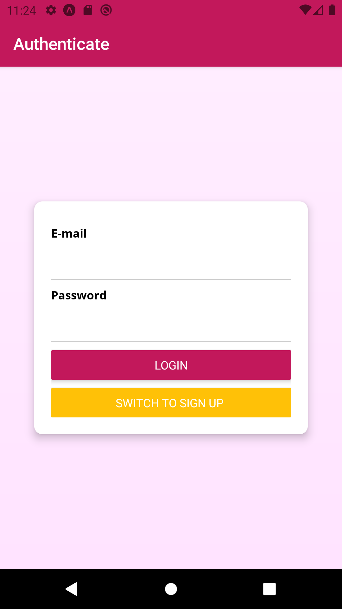

 

# ShopApp

An E-commerce shop app in React Native.

## Features
* Log into your account.
* Add to cart/place order.
* View Order history.
* Add/Sell your products.

## Demo

## How to run

* clone this Repository by `git clone https://github.com/shahshubh/Shop-App.git`.
* Change directory `cd Shop-App`
* Make sure you have expo-cli installed. If not run `npm install -g expo-cli`
* Install the dependencies using `npm install`
* Run `npm start`
* Then type in terminal `a` to run on android emulator, `i` to run on ios simulator.

For more info read `https://reactnative.dev/docs/getting-started`